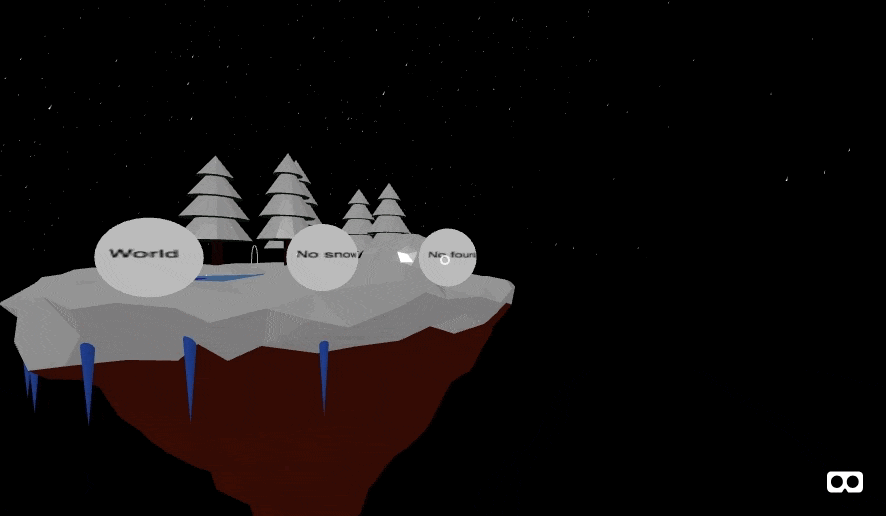

# Fantasy Weather App

The goal of this application was to use particle systems, a Google Poly object, and an environment. 

## Issues

* The snow and fountain do not turn off.
* The fountain particle system does not display at the same time as the environment. It creates many errors in the JavaScript console.
* When the environment is turned off, the pink background remains.

## Attempted Fixes

* We have tried removing the fountain with setAttribute.
* We have tried removing the rain with setAttribute.
* We have tried using createElement, appendChild, and removeChild to control the fountain and the environment -- however, these elements do not disappear.
* We have tried making the environment not active, although it still exists and prevents the particle system from running after it is created.

## Resolved Issues

* The snow does display at the same time as the environment, because it is a rain attribute.
* The environment turns off (except for the pink background).